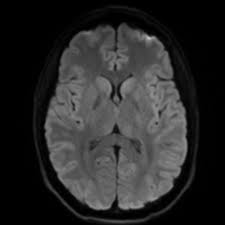
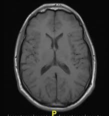

# Fourier Imagie Studio
This project applies integral calculus (Fourier series) to edit images, addition of filters, watermark, blurring, steganography(image encryption), compression and decompression of images. it is efficient and scalable.

A powerful image processing application leveraging Fourier transform techniques for advanced image analysis and manipulation.

## Features

- **Fourier Transform Analysis** - Decompose images into frequency components
- **Image Processing** - Apply filters and enhancements in the frequency domain
- **Visual Studio** - Interactive interface for real-time image manipulation
- **High Performance** - Optimized algorithms for fast processing

# Before
- 
# After 
- 

## Quick Start

1. Clone the repository
2. Install dependencies
3. Run the application
4. Load an image and start processing

## Use Cases

- Image enhancement and restoration
- Noise reduction and filtering
- Pattern analysis and detection
- Digital signal processing

## License

Open source project. See LICENSE for details.
